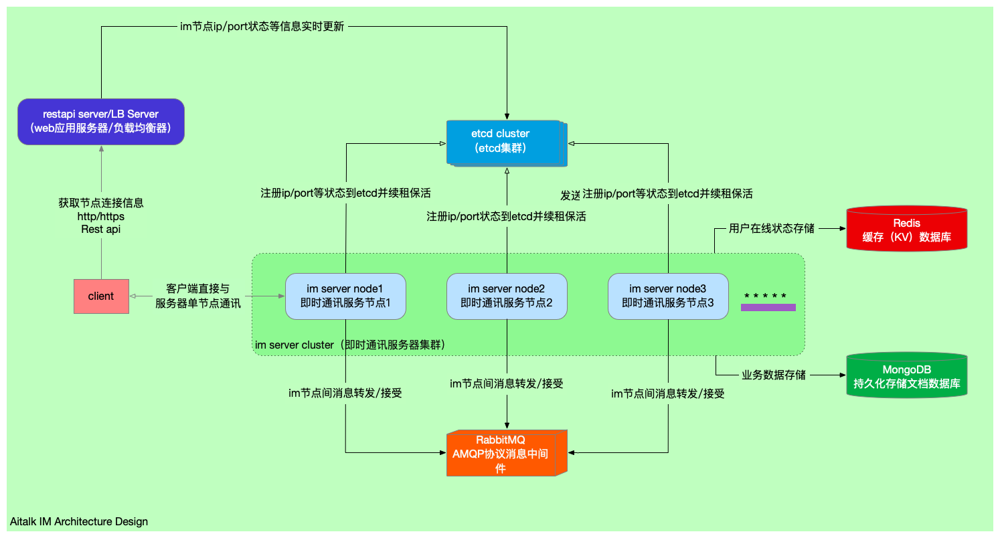

aitalk 即时通讯
# 打包
```shell script
mvn package [-Preview|-Pstaging|-Pproduction]
```
# aitalk-im 启动
#### maven 方式启动
```shell script
mvn exec:java -Dexec.mainClass="com.aihangxunxi.aitalk.im.AitalkImApp" -Pdevelop
```
#### jar 包方式启动
```shell script
java -jar aital-im.jar 
```
##### 启动参数
######  开启log4j2 全局异步日志输出
```shell script
-Dog4j2.contextSelector=org.apache.logging.log4j.core.async.AsyncLoggerContextSelector
```
###### 泄漏检测
```shell script
-Dio.netty.leakDetectionLevel=ADVANCED
```
###### UTF-8字符集编码，防止输出乱码
```shell script
-Dfile.encoding=utf-8 
```
## mongodb 参考
http://mongodb.github.io/mongo-java-driver/4.1/driver/getting-started/quick-start-pojo/

## 架构


## 功能列表  

* [ ] 消息功能
    * [ ] 收发消息（支持文字、语音、图片、表情、视频、地理位置、文件、产品）   
    * [ ] 消息转发（多选->转发->确认发送）
    * [ ] 消息撤回 
    * [ ] 本地消息删除 
    * [ ] @功能（群组中@某人，提醒特别关注消息）
    * [ ] 多终端已读同步
    * [ ] 消息推送提醒
    * [ ] 消息窗口未读消息猫点功能

<br>

* [ ] 主页（店铺/机构）咨询 

<br>

* [ ] 通知
    * [ ] 爱航系统通知 

<br>

* [ ] 搜索功能  

<br>

* [ ] 聊天记录功能  

<br>

* [ ] 文件上传下载  

<br>

* [ ] 消息列表（最近联系人）  
    * [ ] 咨询（单独入口）   
    * [ ] 好友消息    
    * [ ] 群组消息   

<br>

* [ ] 联系人列表  
    * [x] 好友列表    
    * [x] 群组列表    
    * [ ] 粉丝列表    
    * [x] 新的朋友   

<br>

* [ ] 好友功能    
    * [ ] 搜索好友    
    * [ ] 添加好友    
        * [ ] 搜索用户名或手机号增加好友  
        * [ ] 用户通讯录增加好友  
    * [ ] 移除好友    
    * [ ] 获取好友列表        
    * [ ] 获取黑名单列表  
    * [ ] 添加黑名单  
    * [ ] 移除黑名单  

<br>

* [ ] 群组功能    
    * [ ] 管理群组    
        * [ ] 创建一个群组(头像/名称/二维码)  
        * [ ] 修改群组信息    
        * [ ] 获取群组详情    
        * [ ] 解散（删除）群组    
    * [ ] 管理群组成员    
        * [ ] 获取群组成员    
        * [ ] 添加/邀请群组成员   
        * [ ] 群组邀请确认    
        * [ ] 移除群组成员    
        * [ ] 群组全员禁言    
        =============================
        * [ ] ~~获取群组管理员列表未【未确认】~~
        * [ ] ~~添加群组管理员【未确认】~~   
        * [ ] ~~移除群组管理员【未确认】~~    
        * [ ] ~~转让群组【未确认】~~  
    * [ ] 群消息免打扰

<br>  

* [ ] 投诉举报
        
<br>  

* [ ] 聊天室功能【暂不开发】
    * [ ] 获取（附近）聊天室列表
    * [ ] 获取用户加入的聊天室
    * [ ] 获取聊天室详情
    * [ ] 创建聊天室
    * [ ] 修改聊室信息
    * [ ] 删除聊天室
    * [ ] 加入聊天室
    * [ ] 退出聊天室
    * [ ] 聊天室禁言


## 其他问题
